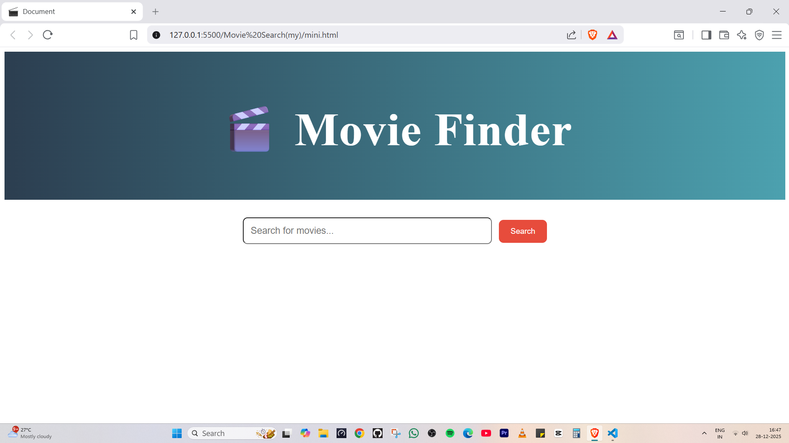
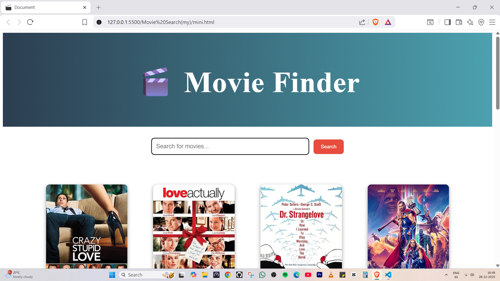
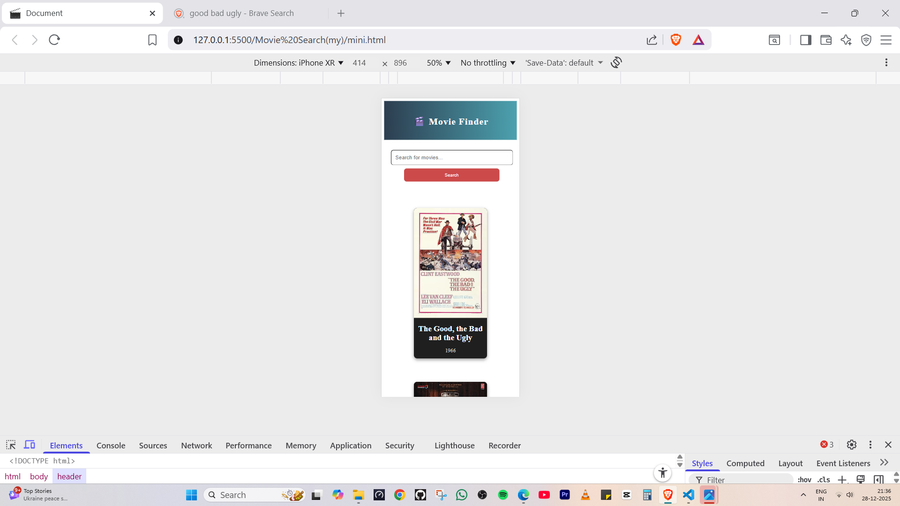

# 🎬 Movie Search App

This is a simple, responsive Movie Search web application built using **HTML**, **CSS**, and **JavaScript**, powered by the **OMDb API**. Users can search for movies by title and view key information like posters, titles, and release years.

---

## 🔍 Features

- Search movies using keywords
- Fetch data from the OMDb API
- Display top 6 results with poster, title, and year
- Handles empty inputs and API errors
- Search on button click or Enter key
- Loading indicator while fetching data

---

## 🌐 Live Demo

🚀 **Live Application:**  
👉 https://get-movie-search.netlify.app/  

📂 **GitHub Repository:**  
👉 https://github.com/ponraj2006/movie-search-app/

---

## 📸 Screenshots

### 🔍 Movie Search Page


### 🎬 Search Results


### 📱 Mobile View


---

## 🛠️ Tech Stack & Skills Used (ATS Keywords)

- **HTML5** – Semantic markup
- **CSS3** – Flexbox, Media Queries, Responsive Design
- **JavaScript (ES6)** – DOM manipulation, async/await, event handling
- **REST API Integration**
- **Frontend Development**
- **UI/UX Fundamentals**
- **Git & GitHub**

---

## 🧠 How It Works

1. User enters a movie name.
2. App sends a fetch request to OMDb API.
3. It displays the top 6 matching movies with poster, title, and year.
4. If no results found, an error message is shown.

---

## 🔑 API Configuration

This project uses the **OMDb (Open Movie Database) API**.

### Steps to configure:

1. Get a free API key from  
   👉 https://www.omdbapi.com/

2. Add your API key in `script.js`:
```js
const API_KEY = "YOUR_API_KEY_HERE";

